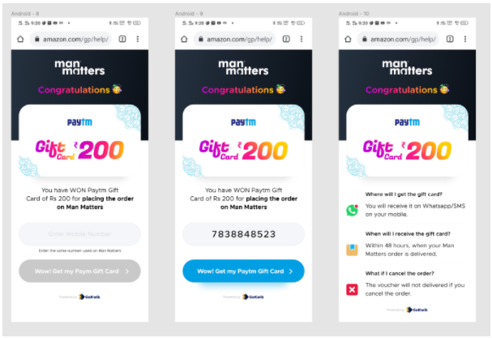

# Go-Kwik

https://go-kwik.vercel.app/

Assesment was to do the following:

PFA an image file, can you create a react.js based project for this, requirement is

1. It should be responsive (the current design is as per mobile, you can use your imagination for desktop layout)

2. when a user enters a valid Indian mobile number then only the "get my Paytm card" button should be activated.

3. once the user click on that button that number should be stored on local storage and thank you page will be shown

4. if the user lands on the page again (page refresh) and because he has already submitted his number he should only see the thank you screen

